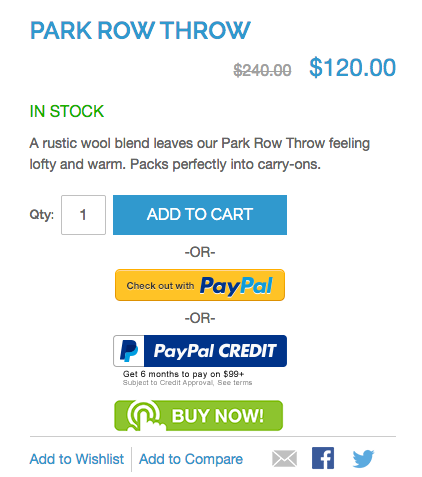
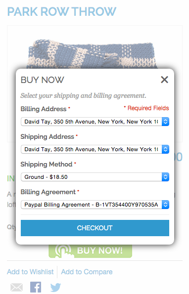

BuyNow
======

Description
-----------
Adds a Buy Now button to your product or landing page. When the button is clicked
on, user can checkout in two clicks. Not exactly a one-click checkout, but two clicks.

With the ability to checkout nearly instantly, your conversions will be significantly 
improved. Requires a billing agreement, or the user will be redirected to regular 
checkout for the first time. 

Installation Instructions
-------------------------
Upload the files to your website, disable compilation and clear cache, etc. On the 
product page will be the Buy Now button:

Click on the button and the user will be required to login. Once logged in, product
will be added to the cart and the user can checkout:

